# 第七章 图

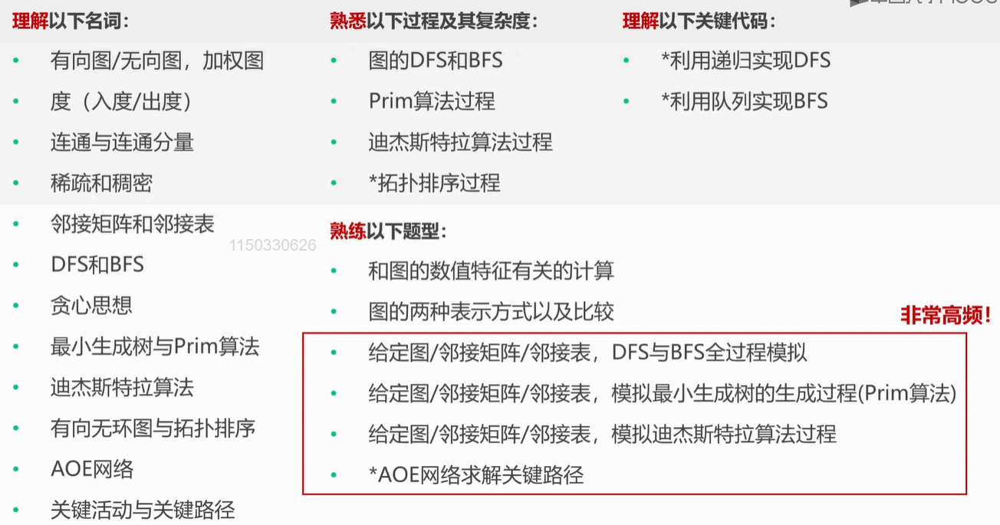

## 7.1 图的基本概念

&emsp;&emsp;图（Graph）是由顶点的有穷非空集合和顶点之间边的集合组成的。通常表示为 `G(V,E)`，其中，`G`表示—个图，`V`是图 `G`中**顶点的集合**，`E`是图`G`中**边的集合**。**图是多对多的逻辑结构。**

&emsp;&emsp;通过以下示例理解图的基本概念：	
- 假设 ABCDEFG 是 7 个电话，之间的连线表示有通信线路
- **电话**就是**图的顶点**，**通信线路**是**边**，整体就是一个图
- 任意两个电话间有线路，就可以相互通话（无向图）
- 电话（顶点）连接的线路**（边）的数量**就是**度**
- `ABCD`和`GF`之间消息**无法传递**，就是**不连通**
- `ABCD`和`GF`是两个 **连通分量**

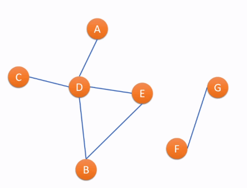

- 假设 `ABCDE`是五个电话，之间的连线表示修有通信线路有，数字表示该线路的电话费
- 不同通信线路上的电话费不同：**加权图 **

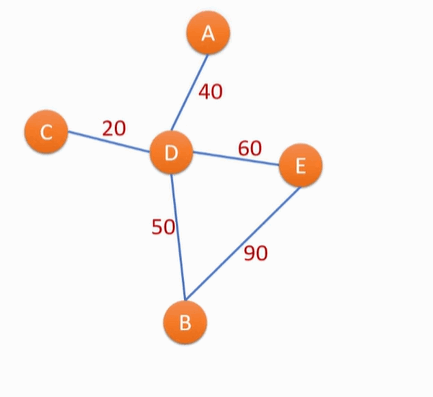

- 假设`ABCDE`是五个城市，带箭头连线表示该方向上有航班飞行
- 例如航班`A->D`只能支持`A`飞往`D`，边是单向的（**有向图**）
- 飞来某地的航班数量：**入度**
- 从某地起飞的航班数量：**出度**

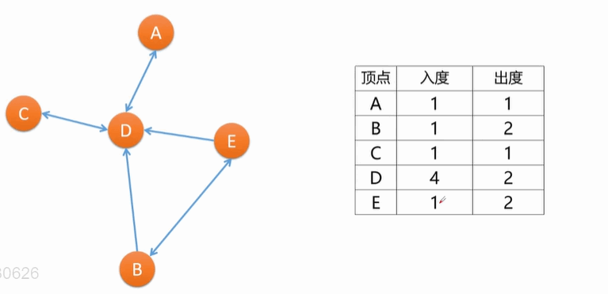

&emsp;&emsp;图并非只能表示地理数据，只要数据元素间满足多对多关系即可。为了更好的理解图，大家可以尝试回答以下思考题：

1. 几个学生之间的朋友关系用什么图表示？
2. 社交媒体的关注/粉丝关系用什么图表示？
3. 多个耗时不同的任务之间的依赖关系用什么图表示？

**解答：**

1. 无向有权图
2. 有向无权图
3. 有向加权图

**相关知识点：**

- 无向和有向的区别在于，关系上是双向还是单向，如果所有路径都是双向的，则为无向图，有单向的路径则为有向图。
- 无权和加权的区别在于，是否有消耗或者是费用等附加量，有则为加权图，没有则为无权图。
- 在一个**无向图**中，所有顶点的**度数之和**为**边数量的 2 倍**，边数最多为 $\text{结点数} \times (\text{结点数}-1) / 2$。
- 在一个**有向图**中，所有顶点的**出度之和**为所有顶点的**入度之和**。

## 7.2 邻接矩阵和邻接表

### 7.2.1 邻接矩阵

&emsp;&emsp;图可用一个 $n \times n$ 方阵表示，即一个二维数组`AdjMat[n][n]`，被称为邻接矩阵，其中`AdjMat[i][j]`表示 $v_i$ 到 $v_j$ 的邻接情况。

**无向无权图：**

**有向加权图：**

### 7.2.2 邻接表

&emsp;&emsp;每个顶点用一个链表存下自己的邻居，有 $n$ 个链表，即图可用一个链表的数组`Adjlist[n]`存储，该数组被称为邻接表。其中，`Adjlist[i]`表示顶点 $v_i$ 的链表（头结点），从`Adjlist[i]`开始遍历所有 $v_i$ 的邻居。

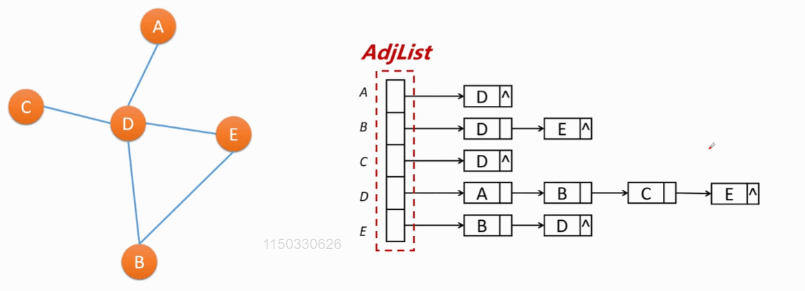

### 7.2.3 邻接矩阵和邻接表的比较

&emsp;&emsp;**邻接矩阵**无论如何**都需要一个二维数组** `[n][n]`表示，而**邻接表**中每条链表长度**取决于它有多少邻居（即边越少，占空间越小）。**

&emsp;&emsp;**邻接矩阵**访问`AdjMat[i][j]`的复杂度为 $O(1)$，但邻接表访问特定边需要顺着起点的**链表向后查找**，算法复杂度为 $O(N)$。

- **邻接表的优点**：在边较少时节省许多空间，使用于**稀疏图**（适用于边少的情况）。
- **邻接表的缺点**：无法直接获取某条边的信息，需要 $v_i$ 链表进行从头顺序存取，最坏情况下为 $O(N)$。

## 7.3 图的 DFS 和 BFS 遍历

### 7.3.1 DFS：深度优先遍历

&emsp;&emsp;深度优先遍历使用**递归/栈**实现，从起点开始，优先遍历除了自己以外的结点中所有未访问过的结点。

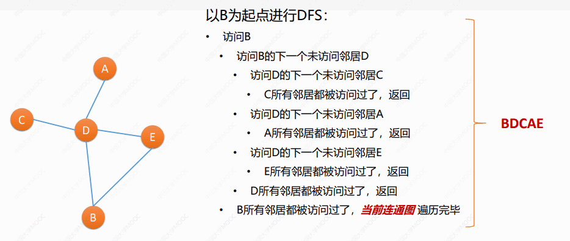

&emsp;&emsp;大家可以尝试回答以下问题：给定如下邻接矩阵，写出由 B 点出发的一个 DFS 序列。

**解答：**

​

### 7.3.2 BFS：广度优先遍历

&emsp;&emsp;广度优先遍历也称为**层序遍历**，使用**队列**实现，

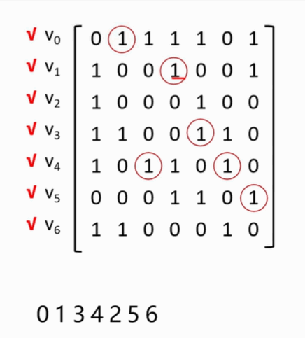

&emsp;&emsp;大家可以尝试回答以下问题：给定如下邻接矩阵，写出由 $v_0$ 出发的深度优先遍历结果为（），广度优先遍历结果为（）。

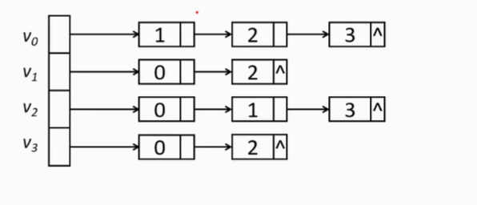

**解答：**

1. 0123
2. 0123

## 7.4 最小生成树

### 7.4.1 生成树

&emsp;&emsp;对于含 $n$ 个结点的一个无向连通图，其边数最多为 $n(n-1) / 2$ 条，最少为 $n-1$ 条。保持连通性的情况下，选 $n-1$ 条边出来，剔除其他边（去闭环），它就变成了一棵树。生成树中是没有环的。生成树的公式如下：
$$ 
n 个结点 + n-1 条边 + 连通 = 生成树
$$

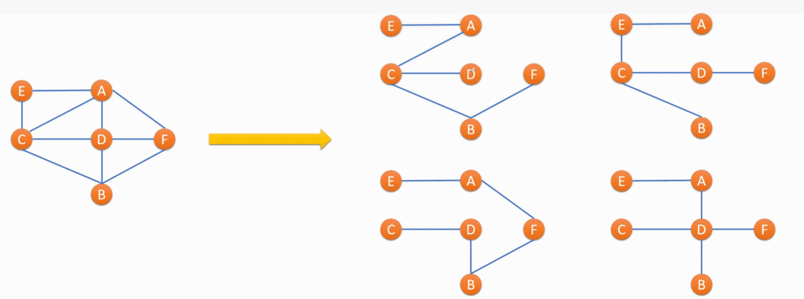

### 7.4.2 最小生成树 MST

&emsp;&emsp;在加权图中选出 $n-1$ 条边来构成生成树，使得这个生成树的边的权值之和最小，则称这个生成树为最小生成树（MST）。MST 不一定唯一（如最小权值相同的生成树有多个）。如下图所示：

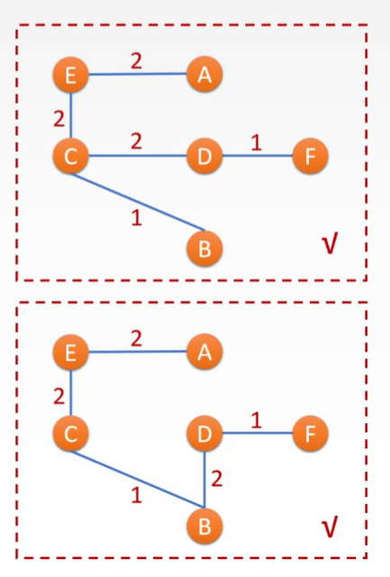

&emsp;&emsp;大家可以尝试回答以下问题：MST 的意义是什么？

**解答：**

&emsp;&emsp;求在多个解决方案中，消耗或者是费用最小的解决方案。例如：城市造路，求花费最小的造路方案。

### 7.4.3 求最小生成树：Prim 算法

&emsp;&emsp;Prim 算法也称为**加点法**。构造最小生成树可以使用以下策略：贪心的思想。每次在连接**已完成结点和未完成结点的边中**，选一条权值最小的，重复 $n-1$ 遍。局部最优使得全局最优。每次加入结点时必须满足：这个点所属边的权值最小，加点不会形成环。

&emsp;&emsp;大家可以尝试回答以下问题：给定如下图结构，求其最小生成树。

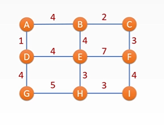

**解答：**

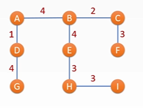

## 7.5 Dijkstra算法

&emsp;&emsp;求单源点最短路径算法是 Dijkstra 算法，该算法的主要思想是在加权图中，求从一个顶点`s`出发到其他各点的最短距离，算法循环 $n-1$ 次，每次执行以下操作：

1. 找到未完成结点中，`s->t` 距离最短的`t`，将`t`标注未已完成
2. 以`t`为中转更新`s`至`t`的邻居们的距离

